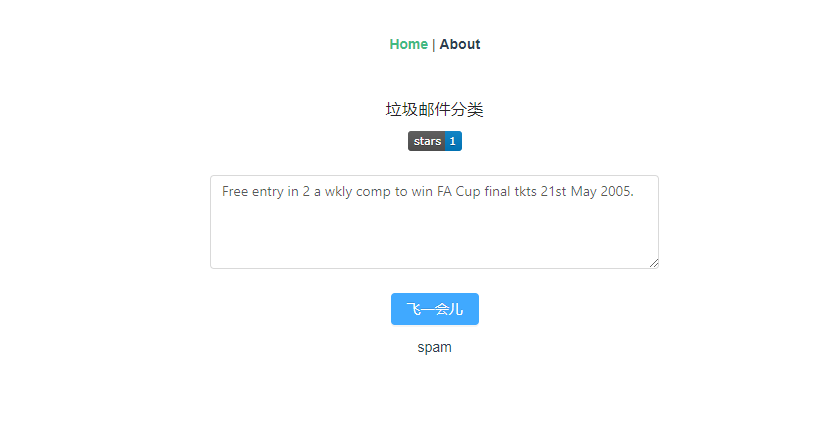

# mini-sms-classify
>基于支持向量机垃圾邮件分类，使用SVM+flask+vue



## 支持向量机原理
线性分类器的任务就是从训练数据中估计出决策边界的参数 $W$ 和 $b$ ，这些数据满足：
$$
\left\{\begin{array}{ll}
{W \cdot X_{i}+b \geqslant 1} & {\text { if } y_{i}=1} \\
{W \cdot X_{i}+b \leqslant-1} & {\text { if } y_{i}=-1}
\end{array}\right.
$$
换个方式写就是：
$$
y_{i}(w^T \cdot x+b) \geqslant 1, i=1,2, \ldots, N
$$
另外根据上文最大间隔的公式，为了计算的方便，将其转化为如下形式：
$$
\frac{\left\|w^{2}\right\|}{2}
$$
这样，最大化间隔就变为求最小化的问题。

综上所述，加上之前的约束条件 $y_{i}(w \cdot x+b) \geqslant 1$ ，现在需要解决的就是如下的优化问题：
$$
\left\{\begin{array}{l}
{\min\frac{\left\|w^{2}\right\|}{2}} \\
{\text { s.t. } y_{i}(w^T \cdot x+b) \geqslant 1}
\end{array}\right.
$$
观察这个式子可知，目标函数是二次的，约束是线性的，那么我们要计算的优化问题就是凸二次优化问题。

如何解决？凸优化问题直接求解过程复杂，而且不利于推广。我们利用拉格朗日乘子法，将原问题转化为对偶问题，这个更方便求解，而且通过加入核函数，能推广到非线性分类的求解。

现在利用拉格朗日乘子法将原优化问题转化为下面的形式：
$$
\mathcal{L}(\boldsymbol{w}, b, \boldsymbol{\alpha})=\frac{1}{2}\|\boldsymbol{w}\|^{2}-\sum_{i=1}^{n} \alpha_{i}\left(y_{i}\left(\boldsymbol{w}^{\mathrm{T}} \boldsymbol{x}_{i}+b\right)-1\right)
$$
根据拉格朗日对偶性质，原始问题的对偶问题就是最大化最小化原始问题，原始问题表示为：
$$
\min _{\boldsymbol{w}, b} \max _{\alpha_{i} \geq 0} \mathcal{L}(\boldsymbol{w}, b, \boldsymbol{\alpha})=p^{*}
$$
可以得到其对偶问题：
$$
\max _{\alpha_{i} \geq 0} \min _{\boldsymbol{w}, b} \mathcal{L}(\boldsymbol{w}, b, \boldsymbol{\alpha})=d^{*}
$$
为什么可以这么表示，因为其满足Slater条件，（故而 $d^*$ 等于 $p^*$ ）。进而满足KKT条件。

那么求解这个最小化最大化对偶问题如何求解？首先分别对参数 $w$ 和 $b$ 求偏导数，令其为0，可得：
$$
\begin{aligned}
&\frac{\partial \mathcal{L}}{\partial \boldsymbol{w}}=0 \Rightarrow \boldsymbol{w}=\sum_{i=1}^{n} \alpha_{i} y_{i} \boldsymbol{x}_{i}\\
&\frac{\partial \mathcal{L}}{\partial b}=0 \Rightarrow \sum_{i=1}^{n} \alpha_{i} y_{i}=0
\end{aligned}
$$
将上式带入 $\mathcal{L}(\boldsymbol{w}, b, \boldsymbol{\alpha})$ 中，得到：
$$
\mathcal{L}(\boldsymbol{w}, b, \boldsymbol{\alpha})=\sum_{i=1}^{n} \alpha_{i}-\frac{1}{2} \sum_{i, j=1}^{n} \alpha_{i} \alpha_{j} y_{i} y_{j} \boldsymbol{x}_{i}^{\mathrm{T}} \boldsymbol{x}_{j}
$$
现在化解了参数 $w$ 和 $b$ ，接下来求解对 $\alpha$ 的最大值。可以得到：
$$
\begin{array}{l}
{\max _{\alpha} \sum_{i=1}^{n} \alpha_{i}-\frac{1}{2} \sum_{i, j=1}^{n} \alpha_{i} \alpha_{j} y_{i} y_{j} \boldsymbol{x}_{i}^{\mathrm{T}} \boldsymbol{x}_{j}} \\
{\text { s.t. } \alpha_{i} \geq 0, i=1,2, \cdots, n} \\
{\sum_{i=1}^{n} \alpha_{i} y_{i}=0}
\end{array}
$$
这个凸二次优化问题的式子利用SMO算法求解即可。
## 如何运行
### server端
```bash
cd server
# 创建虚拟环境
python -m venv env
# 激活虚拟环境
source env/bin/activate
# 安装依赖包
pip install -r requirements.txt
# 启动flask
python app.py

```
### client端
```bash
npm install
npm run server
```